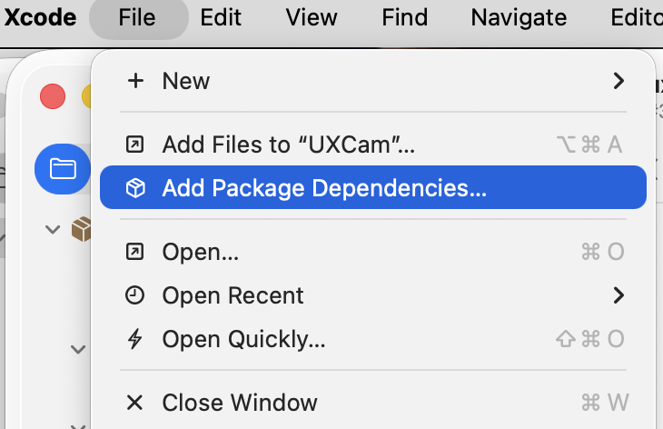
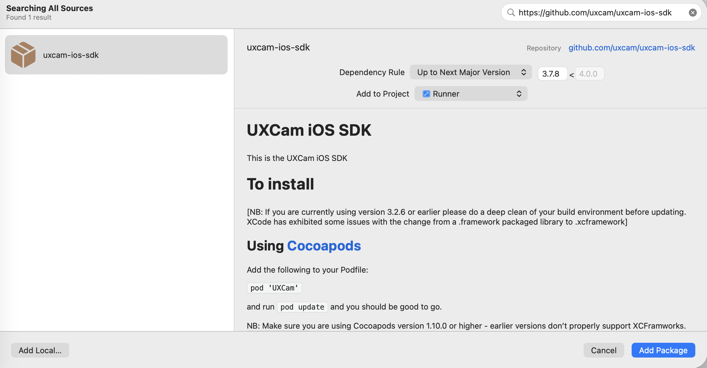

# Using Swift Package Manager

UXCam supports Swift Package Manager on Xcode 13 or newer.

## Add the package in Xcode

1. Select **File → Add Package Dependencies…**.
2. Enter `https://github.com/uxcam/uxcam-ios`.
3. Select a version-based dependency rule.
4. Add the `UXCam` product to the required application targets.

See [MIGRATION.md](MIGRATION.md) before changing an existing
`uxcam-ios-sdk` dependency.
